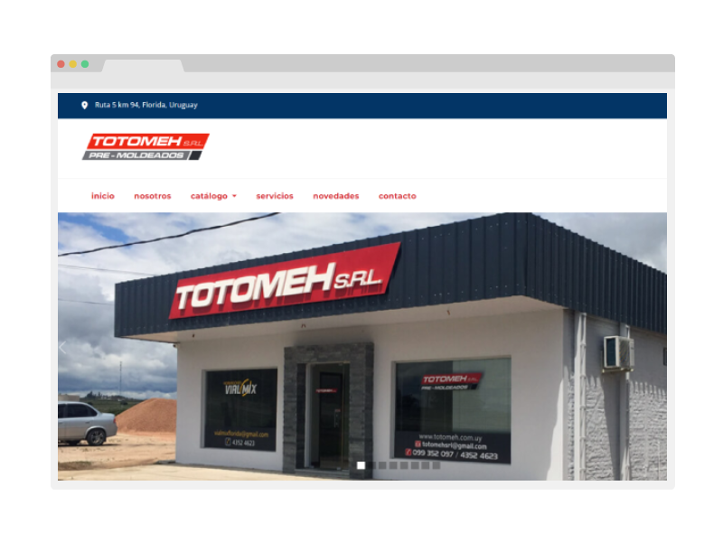

<div id="top"></div>

<!-- PROJECT LOGO -->
<br />
<div align="center">
  <a href="https://github.com/Creativo-Multimedia/totomeh-web">
    
  </a>

<h3 align="center">Totomeh web</h3>

  <p align="center">
    Static website built with html modules, SASS, Bootstrap and Vanilla Javascript.
    <br />
    Developed by <a href='http://creativo.com.uy/' target='_blank'>Creativo Multimedia</a>
    <br/>
    <a href="http://totomeh.com.uy/">View online</a>
  </p>
</div>


<!-- TABLE OF CONTENTS -->
<details>
  <summary>Table of Contents</summary>
  <ol>
    <li>
      <a href="#about-the-project">About The Project</a>
      <ul>
        <li><a href="#built-with">Built With</a></li>
      </ul>
    </li>
    <li>
      <a href="#getting-started">Getting Started</a>
      <ul>
        <li><a href="#installation">Installation</a></li>
      </ul>
    </li>
  </ol>
</details>


<!-- ABOUT THE PROJECT -->
## About The Project



The objective of this project was optimize the resources of the hosting service.
The initial size of the web was 160mb, mainly because of CMS files. This project size, developed in vanilla code is less than 10mb, assets included.
It uses "components" of html to reuse the common code, like Bottom, Footer and Header sections.


<p align="right">(<a href="#top">back to top</a>)</p>


### Built With


<p align="right">(<a href="#top">back to top</a>)</p>


<!-- GETTING STARTED -->
## Getting Started

### Installation

1. Clone the repo
   ```sh
   git clone https://github.com/Creativo-Multimedia/totomeh-web.git
   ```
2. Go to <a href='https://formsubmit.co/' target='_blank'>formsubmit.co</a> and create an account.
3. Create a config.js file and add your email recipient
    ```js
    export const emailRecipient = 'your@email'
    ```
4. Compile SASS into CSS
    ```sh
    sass --watch styles/main.scss css/main.css
    ```

<p align="right">(<a href="#top">back to top</a>)</p>